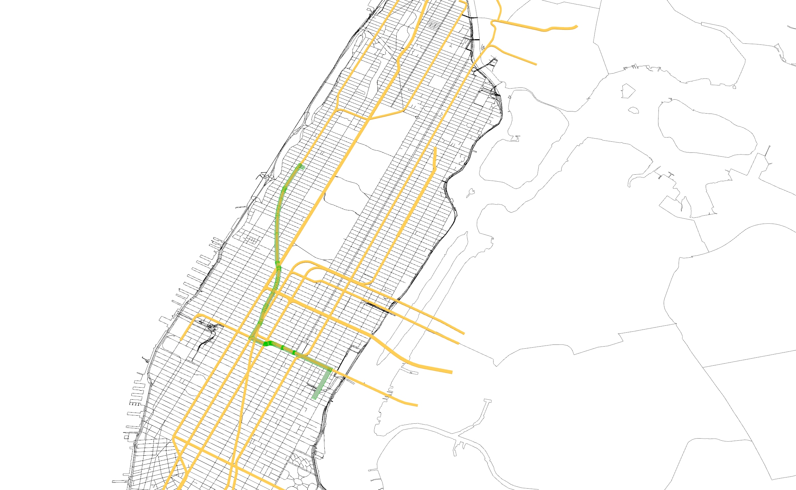

# GH-transportation-inequality

### Summary

This component looks for which subway line should be added to make neighborhoods of Manhattan equal in terms of subway travel time.

### Metric
The main metric is the standard deviation of addition of all the travel time to each city. 

### Result
 

Green colored line : exsiting subway line. 
Red colored line : proposed subway line.

Orange-colored region : sum of travel time to that region is longer than others. 
